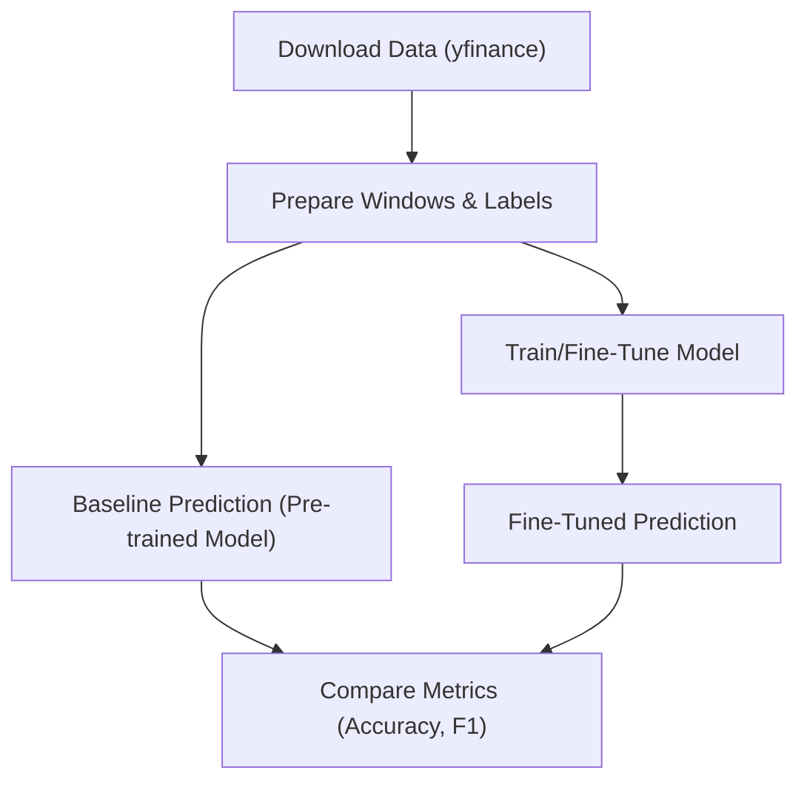

# Market Predictor 

Below is the complete starter repository for the task. I've structured it as a GitHub-style repo description, with file contents provided in code blocks. You can copy these into files to create the repo locally.

## Suggested Models
Based on the hardware constraints (Ubuntu host with 32GB RAM and RTX 3060 GPU with 12GB VRAM), I suggest the following 4 open-source time series forecasting models available on Hugging Face. These are lightweight (under 1B parameters), support multivariate time series (for OHLCV data), can be downloaded locally, and fine-tuned for forecasting. They can predict future OHLCV values, from which we derive the UP/DOWN/SIDEWAY label:

1. **google/timesfm-2.5-200m-pytorch** (200M parameters): A time series foundation model from Google, efficient for forecasting (timesfm==2.0.0).
2. **time-series-foundation-models/Lag-Llama** (small transformer-based): Probabilistic univariate/multivariate forecaster.
3. **ibm-granite/granite-timeseries-ttm-r2** (<1M parameters): Tiny Time Mixers from IBM, very lightweight and fast.
4. **Melady/TEMPO** (foundation model): Open-source time series model for forecasting tasks.

These fit within your hardware: Inference and fine-tuning should work with batch sizes of 1-16, using FP16 if needed for memory efficiency. Download them via `transformers` library from Hugging Face.

The applications below are implemented to work with these models configurably (via command-line args). For prediction, the model forecasts the next day's OHLCV, then derives the label based on the criteria (comparing predicted High/Low to the last day's High/Low).

# Market Predictor Repo

This repository provides a baseline for market prediction using open-source time series models. It includes scripts for data preparation, prediction (baseline), fine-tuning, and performance comparison.

## Suggested Models
- google/timesfm-1.0-200m
- time-series-foundation-models/Lag-Llama
- ibm-granite/granite-timeseries-ttm-r2
- Melady/TEMPO

These are downloadable from Hugging Face and suitable for a Ubuntu host with 32GB RAM and RTX 3060 GPU.

## Directory Structure
```
market_predictor/
├── README.md                # This file
├── Dockerfile               # Docker build file
├── docker-compose.yml       # Compose file for sub-tasks (use 'docker compose' command)
├── requirements.txt         # Python dependencies
├── data/                    # Directory for downloaded/prepared data (add to .gitignore if needed)
│   └── .gitignore           # Ignore large data files
├── models/                  # Directory for saved fine-tuned models
└── src/                     # Source code
    ├── data_prep.py         # Script for downloading and preparing data
    ├── predict.py           # Application for market prediction and baseline evaluation
    ├── finetune.py          # Application for fine-tuning models
    └── utils.py             # Shared utilities (e.g., label derivation)
```

## System, Architecture, and Data Flow Diagram

### System Overview
The system runs on Ubuntu with Python 3.10+, using PyTorch for GPU acceleration. Models are loaded via Hugging Face Transformers. Data is OHLCV (Open, High, Low, Close, Volume) from stock tickers.

### Architecture
- **Data Layer**: Downloads via yfinance, prepares windows of n days with labels (UP/DOWN/SIDEWAY).
- **Model Layer**: Loads pre-trained models, fine-tunes on prepared data.
- **Prediction Layer**: Forecasts next OHLCV, derives label.
- **Evaluation Layer**: Computes accuracy/F1 on test set.

### Data Flow Diagram


## Steps to Create a Virtual Environment
1. Ensure Python 3.10+ is installed.
2. Create venv: `python3.12 -m venv env`
3. Activate: `source env/bin/activate`
4. Install packages: `pip install -r requirements.txt`
* if host installed CUDA 12.0 to 12.3, install torch as below:
`
pip install torch torchvision torchaudio --index-url https://download.pytorch.org/whl/cu126
`
* if timesfm cannot resolve version.
`
pip install timesfm==1.3.0 --ignore-requires-python
` 

* Test with `python -c "import torch; print(torch.cuda.is_available())"` — it should return True.

## Steps to Create a Docker Container
1. Build the image: 
`
docker build -t market-predictor .
` for CUDA 12.0 and cuDNN8.
or 
build the image: 
`
docker build -f Dockerfile.12.3 -t market-predictor .
` for CUDA 12.3 and cuDNN9
2. Run interactively: 
`
docker run --rm -it --gpus all -v $(pwd)/data:/app/data -v $(pwd)/models:/app/models market-predictor bash
`

Alternatively, use docker compose for sub-tasks (see below).

## Basic Commands


## Steps to Execute the Application to Produce Performance Metrics

#### 1. Prepare data: 
```bash
# Auto-generate filename based on parameters (recommended)
python src/data_prep.py --tickers AAPL,GOOG --n 60 -s 500

# Or specify custom output filename
python src/data_prep.py --tickers AAPL,GOOG --output data/my_custom_data.csv --n 60 -s 500
```

**Auto-generated filenames** follow the pattern: `data_{tickers}_{window_size}w_{samples}s_{timestamp}.csv`
- Example: `data_AAPL_GOOG_60w_500s_20250118_143022.csv`

Each dataset automatically generates a `_metadata.json` file that tracks the parameters used.

**View available datasets:**
```bash
python src/data_manifest.py list              # List all prepared datasets
python src/data_manifest.py show <filename>   # Show details of a specific dataset
python src/data_manifest.py clean             # Keep 3 most recent, remove older ones
```
 
#### 2. Run baseline prediction/evaluation: 

###### Evaluate model on test data
   - This uses the pre-trained model on a test split, computes accuracy/F1 for UP/DOWN/SIDEWAY predictions.

   - Evaluate TimesFM on test data
```bash
python src/predict.py --model timesfm --data data/prepared_data.csv --eval --output metrics.json
```

   - Evaluate Lag-Llama on test data
```bash
python3 src/predict.py --model lag_llama --data data/prepared_data.csv --eval --output metrics.json
```

   - Make single prediction with TimesFM
```bash
python src/predict.py --model timesfm --data data/prepared_data.csv --predict --sample 0
```

   - Make single prediction with Lag-Llama
```bash
python src/predict.py --model lag_llama --data data/prepared_data.csv --predict --sample 5
```

### 3. Steps to Fine-Tune a Base Model

  - Prepare data (as above).
  - Fine-tune: 
`
python src/finetune.py --model_name google/timesfm-1.0-200m --data data/prepared_data.csv --output_dir models/finetuned --epochs 5
`
   - This fine-tunes for forecasting, saving to `models/`.

### 4. Steps to Compare Performance Metrics
   - Run baseline metrics (as above).
   - Fine-tune (as above).
   - Run fine-tuned evaluation: `python src/predict.py --model_name models/finetuned - - data data/prepared_data.csv --eval --output metrics/finetuned_metrics.json`
   - Compare manually (e.g., diff the JSON files) or add a custom script to compute deltas in accuracy/F1.

**Notes**: 
- The scripts use placeholders for model-specific processing (e.g., `processor`, `generate`). Adapt based on the exact model docs (e.g., TimesFM has custom usage; see HF page).
- For fine-tuning, the task is set as forecasting next OHLCV, then label derivation in predict.py. If direct classification is preferred, add a classification head.
- Data prep saves windows as strings; parse with `eval` or use JSON/Parquet for better.
- Create `metrics/` dir for outputs.
- Test locally; fine-tuning may require more data/tickers for meaningful results.<|control12|>```